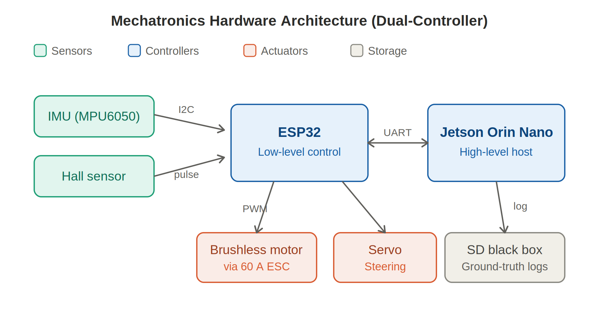
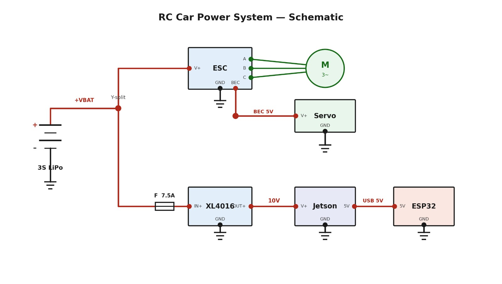
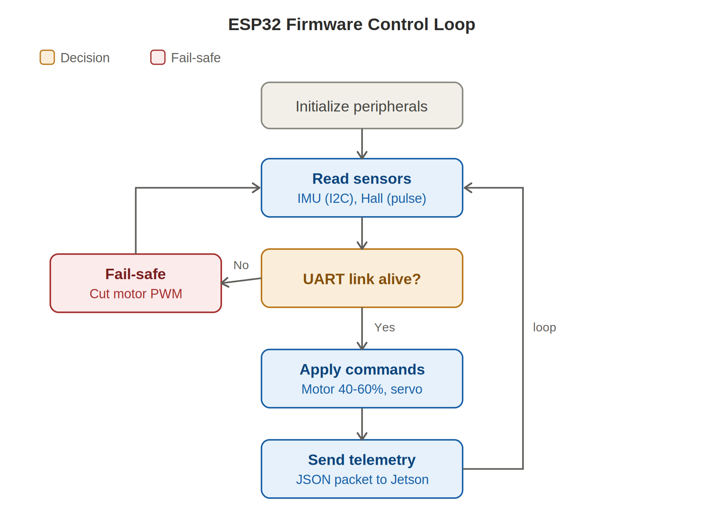
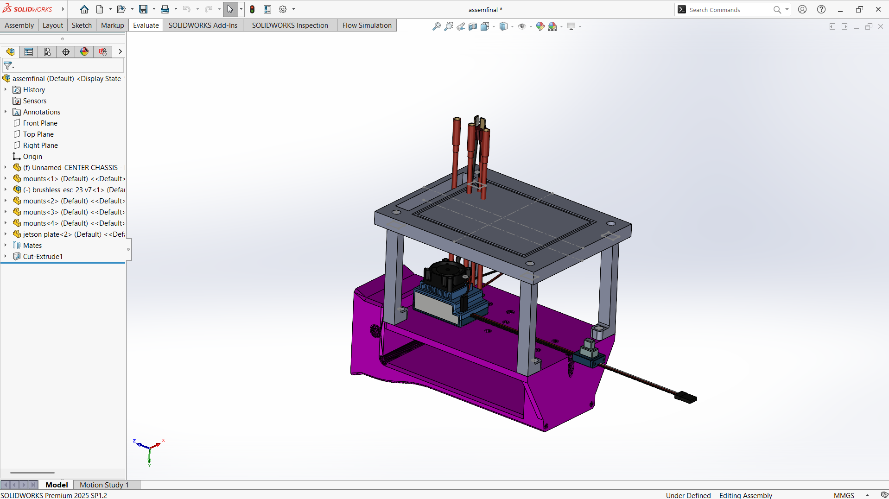
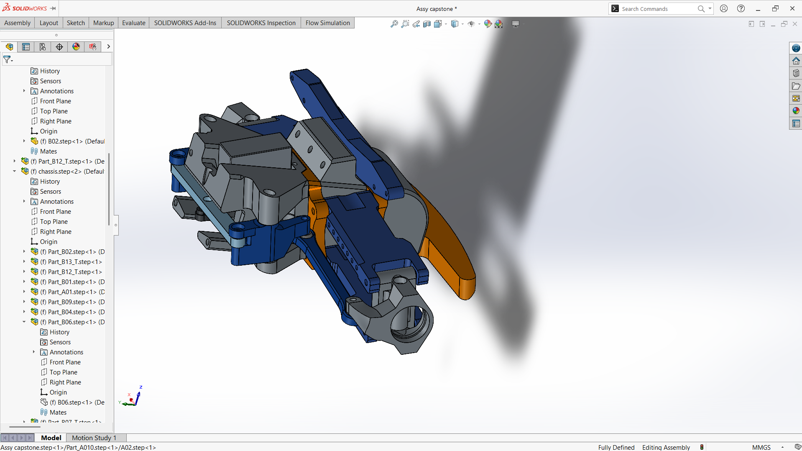
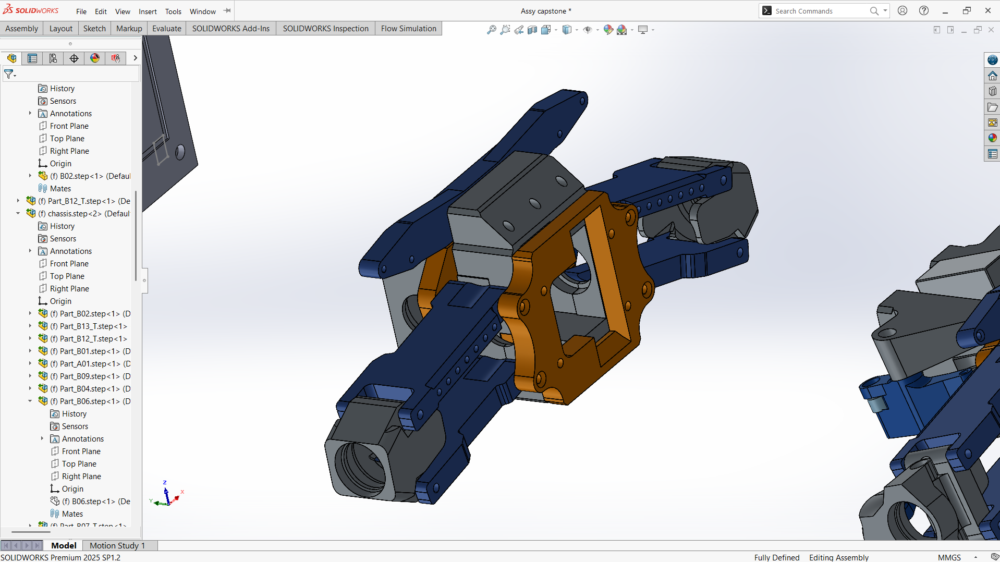
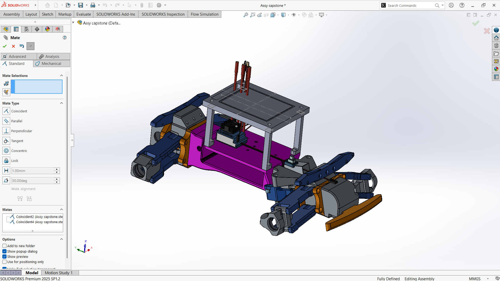

# Smart Car & Driver Monitoring — Mechatronics Subsystem

The physical and embedded foundation of an ADAS (Advanced Driver-Assistance Systems) testing platform for a Smart Car & Driver Monitoring App for Commercial Fleet Management. This repository documents **only the Mechatronics subsystem**: the RC vehicle platform, the real-time ESP32 control firmware, the sensor suite, the power architecture, and the JSON telemetry interface that the AI and Software departments consume.

The Mechatronics subsystem bridges the high-level perception algorithms running on the Jetson Orin Nano with real-world actuation and sensing at the vehicle level. It provides the physical platform (RC vehicle, IMX219 downward-facing camera, controlled test track) and a physically accurate, real-time stream of vehicle-state telemetry from a small-scale RC platform, using low-cost, non-automotive-grade hardware, in a form directly consumable by the software scoring engine.

> **Scope note:** The AI perception (in-cabin driver monitoring, road/lane monitoring) and the application/scoring software (Android client, Spring Boot backend) are owned by the other departments and are **not** included here. They consume this subsystem's telemetry at the defined JSON interface.

---

## Team & Responsibilities

The Mechatronics subsystem was built by two Mechatronics Engineering students:

| Member | Key contributions | Effort |
|--------|-------------------|--------|
| **Karam Zuheir Thaher Qushtom** | Component procurement, SolidWorks chassis design, vibration-dampening sensor mounts, UART telemetry / JSON schema alignment, Jetson power-supply design, ESP32 firmware (IMU acquisition, brushless motor control), IMX219 camera configuration, Jetson flashing / OS bring-up, bench-level integration testing | 50% |
| **Ashraf Atheer Ali Al-Attabi** | Component procurement, ESP32 firmware (brushless motor control via 60 A ESC, servo steering, MPU6050 IMU acquisition, Hall-effect speed sensing, watchdog / fail-safe logic), UART link (firmware side), IMX219 camera configuration, Jetson flashing / OS bring-up, bench-level integration testing | 50% |

**Internal split.** Karam led the SolidWorks design and FDM fabrication, motor/steering control path, and Jetson power supply. Ashraf led the sensing and communication path (IMU acquisition, Hall-effect speed sensing, 20 Hz JSON telemetry) and the SD-card Black-Box logger. The two LED turn-signal outputs and the controller-disconnect fail-safe were implemented jointly. Both members handled component procurement and bench-level integration testing.

---

## Repository Contents

```
smart-car-mechatronics/
├── README.md                              # This document (full mechatronics writeup)
├── firmware/
│   ├── esp32_firmware_excerpts.ino        # All firmware code from the report, by module
│   └── telemetry_schema.json              # Example 20 Hz telemetry packet (ESP32 -> Jetson)
└── docs/images/                           # Architecture, power, control-loop & assembly figures
```

---

## 1. Objectives, Scope, and Limitations

### 1.1 Problem Statement

The Mechatronics subsystem must answer a specific engineering problem: how to produce a physically accurate, real-time stream of vehicle-state telemetry from a small-scale RC platform, using low-cost, non-automotive-grade hardware, in a form that is directly consumable by the software scoring engine without further interpretation.

### 1.2 Objectives

- Implement **real-time ESP32 firmware** controlling a brushless motor (via 60 A ESC) and a steering servo from a Bluetooth Xbox Series X controller.
- Implement a **safe-start gate** that prevents motor activation until both control triggers are confirmed at neutral.
- Implement **proportional, instantaneous reverse/brake** control distinct from ramped forward acceleration, matching the single-click forward/reverse behaviour of the ESC.
- Integrate an **MPU6050 IMU** over I²C, including gyroscope offset calibration and accelerometer resting-offset correction, to produce a zero-biased, correctly signed fore/aft acceleration signal.
- Integrate a **US1881 Hall-effect sensor** for interrupt-driven wheel-speed measurement, converting pulse counts into a linear speed estimate in km/h.
- Package vehicle telemetry (speed, steering angle, acceleration, obstacle distance placeholder, turn-signal state, ignition state, stationary state) into a **JSON schema** matching the Jetson FastAPI server's ESP32 contract, transmitted at **20 Hz over USB serial**.
- Implement a **controller-disconnect fail-safe** that returns the vehicle to neutral if the Xbox controller connection is lost beyond a defined timeout.
- Design and fabricate a **custom 3D-printed chassis** with vibration-dampened sensor mounts, housing the Jetson Orin Nano, ESP32, IMU, Hall sensor, motor/ESC, and battery.
- Implement **turn-signal LED outputs** (left/right) mapped to controller bumper buttons, reflected in the telemetry's `turnSignal` field.
- Develop a **browser-based telemetry dashboard** that visualises live vehicle data over a WebSocket connection to the Jetson FastAPI server.

The objectives collectively define a system that is **safe** (fail-safe and safe-start gate), **responsive** (low-latency Bluetooth control, non-blocking firmware architecture), and **instrumented** (IMU, Hall-effect speed sensor, structured telemetry output). Together they ensure the platform can serve as a reliable and observable testbed for validating ADAS algorithms under controlled, repeatable conditions.

### 1.3 Scope

The scope of the Mechatronics subsystem is limited to the physical vehicle platform: mechanical design and fabrication, real-time embedded firmware, sensor acquisition, actuation, and telemetry transmission to the Jetson. It explicitly excludes the AI perception models and the application/scoring software, which consume this subsystem's telemetry at the defined JSON interface but are owned by the other departments.

### 1.4 Limitations

Limitations are primarily economic and physical:

- **Non-automotive-grade parts.** The platform uses low-cost, off-the-shelf components and 3D-printed parts, introducing a maintenance "time penalty" — a structural failure requires reprinting rather than a part swap. The 3D-printed chassis lacks the rigidity of a production vehicle, so vibration can introduce IMU noise, mitigated by vibration-dampening features at sensor mounts.
- **Timing boundary.** The Jetson is a non-real-time host while the ESP32 is real-time, introducing timing variability at the USB serial boundary.
- **Battery safety.** High-current LiPo batteries require strict fire-safety and charging supervision.
- **Sourcing.** Component sourcing within Turkey at the required specification and budget proved to be a recurring constraint.
- **No true active brake.** The ESC is single-click forward/reverse, not forward/brake — deceleration is achieved by commanding reverse against forward motion. Braking authority is tied to the depth of the reverse command; the physical stopping force is bounded by the ESC's reverse current limit rather than a dedicated brake circuit.
- **Steering ground-noise coupling.** The servo's inrush current during hard steering produces a ground-reference disturbance on the ESC's signal line, momentarily interpreted as a below-neutral (reverse) command. Partially mitigated in firmware (idle pulse raised to true neutral, proportional brake response); the complete hardware fix (relocating the servo ground return to the ESC's BEC ground) was identified and documented but not implemented in this iteration.
- **IMU yaw drift.** MPU6050 roll and pitch are drift-free (gravity-referenced accelerometer); yaw is gyroscope-only and drifts continuously without a magnetometer — suitable only for short-term relative rotation, not a stable compass heading.
- **Hall speed magnitude only.** The Hall-effect sensor cannot distinguish forward from reverse motion, so reverse driving registers as a positive speed in telemetry.
- **Commanded, not measured, steering.** `steeringAngleDeg` is derived from the servo pulse, not a physically measured angle — there is no dedicated steering-angle sensor.
- **Placeholder obstacle distance.** `obstacleDistanceMeters` is a constant placeholder (999.0 m); no ranging sensor is fitted to this iteration.
- **Wireless latency.** The BLE link introduces small, variable latency; a controller dropout triggers the disconnect fail-safe, so the vehicle coasts briefly before stopping rather than stopping instantaneously (no hardware kill switch).

---

## 2. Related Work (Mechatronics-relevant)

The project draws on prior work in RC-scale ADAS platforms, embedded motor control, and inertial sensing:

- **Split-computation architecture.** Sarvajcz et al. proposed dividing computation between a high-level AI processor and a microcontroller to prevent system "freeze" problems. This project extends the idea by using the microcontroller as a ground-truth data logger: even if the high-level AI processor freezes or reboots, the low-level ESP32 continues to record telemetry (speed, steering angle), so the integrity of the driving-session log is never compromised.
- **Jetson platform validation.** Mishra and Sehgal validated the NVIDIA Jetson Orin Nano's capability to support real-time object detection (>30 FPS) under 15 W, justifying its choice for battery-powered safety prototypes.
- **Sensor integration on RC platforms.** Baharuddin et al. elaborated on modifications needed to integrate sensors in RC platforms. This project expands on that with an emphasis on **vibration reduction** — 3D-printed mechanical parts tailored to attenuate vibrations that would otherwise corrupt IMU readings, so that the "Harsh Braking" and "Aggressive Turning" components of the reliability index are grounded in reality.
- **Hybrid wake-up strategy.** Rather than running the power-hungry Jetson continuously, the ESP32 observes IMU threshold levels, and the resource-heavy AI perception stack is initialised only when the vehicle is in motion or on a "pre-trigger" activation.

---

## 3. Methodology — Bench-First, Assemble-Second

The Mechatronics subsystem followed a **bench-first, assemble-second** methodology, adapted from the project-wide simulate-then-validate philosophy. Because chassis 3D printing sat on the critical path and took longer than expected, the electronics and firmware workstream was deliberately **decoupled** from mechanical fabrication: every firmware module and sensor was individually verified on the bench before any component was committed to the printed chassis. This kept electronics development unblocked while printing continued in parallel, and means that once the chassis is available, final assembly proceeds against components that are already individually proven.

**Constraint-driven hardware selection.** Component sourcing within Turkey at the required specification and budget was a recurring challenge, requiring substitutions validated on the bench before acceptance — most notably preferred TVS diodes replaced with back-to-back Zener diode pairs in the power-protection circuit, and the XL4016 buck converter chosen as a locally available alternative to the preferred LTC3780.

**Layered firmware sequence** — each layer fully bench-validated before the next was added:

1. **Core actuation** — ESC throttle/brake/reverse and servo steering from the Xbox controller over Bluetooth. *Validated by* confirming ESC arming at neutral, safe-start gate operation, ramp behaviour under trigger input, proportional brake response, and controller-disconnect fail-safe return to neutral — all observed on the Serial Monitor with wheels off the ground.
2. **IMU integration** — first as a standalone test sketch to confirm axis mapping and calibration, then merged into the control loop as a non-blocking 50 ms sampled task. *Validated by* a dedicated orientation test sketch that printed plain-language movement descriptions (*nose up, lean left, turning right*) against raw axis values.
3. **Wheel-speed sensing** — US1881 Hall-effect interrupt-driven pulse counting converted to km/h. *Validated by* spinning the wheel by hand and confirming pulse counts converted correctly to a speed reading.
4. **Jetson telemetry** — structured JSON output over USB serial at 20 Hz matching the shared schema.

This per-layer validation discipline meant that when a bug appeared, its source was already bounded to the most recently added layer, significantly reducing debugging time compared to a big-bang integration approach.

**Real-time design philosophy.** The ESP32 firmware loop runs without any blocking delays after `setup()`, using non-blocking `millis()`-based timers to multiplex the throttle ramp (15 ms), IMU read (50 ms), and telemetry transmission (50 ms) independently. The Jetson (non-real-time Linux host) consumes the telemetry stream at the USB serial boundary and is explicitly **not** in the control loop — actuation decisions are made entirely on the ESP32. This keeps vehicle safety functions immune to any latency or scheduling jitter on the Jetson side.

**Power architecture** followed the same bench-first philosophy. The full Branch 2 protection circuit (reverse-polarity protection via a P-MOSFET, EMI filtering, regulated 10 V output to the Jetson via the XL4016 buck converter) was simulated in **LTspice** across four test scenarios (reverse polarity, spike injection, EMI attenuation, motor-surge dropout) before any physical build. The LiPo voltage-monitoring circuit (resistor divider on the ESP32 ADC) was bench-verified against known voltages before integration.

---

## 4. System Design & Architecture

The Mechatronics subsystem implements a multi-layered, **dual-controller architecture** that separates real-time, time-critical control from high-level computation. A real-time ESP32 microcontroller owns everything that must happen deterministically — motor and servo PWM generation, IMU sampling, Hall-effect pulse counting, telemetry packaging, and a hardware fail-safe — while the non-real-time Jetson Orin Nano hosts the AI pipeline, logs ground truth, and consumes telemetry. The two communicate over a **USB serial link (USB-C cable, 115200 baud)**, the primary integration surface with the AI and Software departments.


*Figure 1 — Mechatronics hardware architecture (dual-controller).*


*Figure 2 — Vehicle power system.*

### 4.1 Pin Map

The ESP32 DOIT DevKit V1 (ESP32-D0WD-V3) pin assignments are fixed and share no conflicts with the BLE stack, I²C peripheral, or LEDC PWM channels:

| Pin name | GPIO | Function |
|----------|------|----------|
| `SERVO_PIN` | 15 | MG995 steering servo (PWM, 50 Hz LEDC) |
| `ESC_PIN` | 12 | 60 A ESC signal (PWM, 50 Hz LEDC) |
| `VPIN` | 34 | Battery voltage sense (ADC input, 12-bit) |
| `SDA_PIN` | 21 | I²C data — MPU6050 |
| `SCL_PIN` | 22 | I²C clock — MPU6050 |
| `HALL_PIN` | 23 | US1881 Hall-effect interrupt input (`INPUT_PULLUP`, CHANGE mode) |

GPIO 34 is input-only (no internal pull-up). GPIO 23 is `INPUT_PULLUP` and attached to the external interrupt handler in CHANGE mode to capture all four magnet transitions per wheel revolution.

### 4.2 PWM Generation

Both the steering servo and the ESC receive 50 Hz PWM signals generated by the ESP32's LEDC peripheral at 16-bit resolution. A 50 Hz period corresponds to a 20,000 µs frame, with `MAX_DUTY = 2¹⁶ − 1 = 65535`, giving sub-microsecond pulse resolution. The `ledcAttach()` call binds each GPIO to its own LEDC timer channel at 50 Hz; both channels are initialised before `armESC()` so a clean neutral pulse is present on the ESC signal wire from the moment the peripheral is powered. → see `usToDuty()` / `writeServoUs()` / `writeEscUs()` in the firmware.

### 4.3 ESC Throttle, Brake, and Reverse

The 60 A WSDT-60A ESC operates in **single-click forward/reverse mode**. Confirmed on the bench: a 1300 µs test command issued while the motor was spinning forward produced immediate reverse rotation rather than active braking. Consequently, "braking" in this design means commanding reverse against forward momentum rather than relying on an ESC-internal brake circuit.

The throttle decision function implements four cases:

- **LT pressed (reverse/brake):** trigger pressure maps proportionally to pulse depth, applied instantly by overwriting `currentThrottle` without entering the ramp gate.
- **RT pressed, moving backward:** ramps up at `BRAKE_STEP` until neutral, then continues to forward target.
- **RT pressed, at/above neutral:** ramps up at `ACCEL_STEP`; a dead-zone kick snaps `currentThrottle` to `ESC_FWD_SPIN_US` on the first forward-direction tick.
- **Neither trigger:** coasts to neutral at `COAST_STEP`.

The key design insight is that brake depth must **not** depend on `currentThrottle`. When the driver lifts RT and then presses LT, the ramp coasts `currentThrottle` back to neutral in ≈75 ms while the car is still physically rolling forward. If the brake branch tested `currentThrottle > NEUTRAL`, it would find the condition false and fall into the gentle coast path. By snapping to the reverse pulse directly and proportionally to trigger pressure, the brake responds with the same latency whether the command has already coasted or not. → see `decideThrottle()`.

### 4.4 Steering Control

The left joystick horizontal axis (`joyLHori`, 0–65535) is mapped to a servo pulse in `[SERVO_MIN_US, SERVO_MAX_US] = [544, 2400] µs`. A direction-inversion flag (`STEER_REVERSED`), confirmed during bench testing, corrects for the physical mounting orientation of the servo linkage. → see `controlSteering()` (direct mode).

### 4.5 Closed-Loop Heading Assist (Proportional Controller)

A supplementary proportional heading-assist controller was implemented and toggled by the LB button during forward driving. It holds a target heading derived from IMU yaw, updated by the joystick at a commanded turn rate, and closes the loop via the servo (`Kp = 12.0`, `ω_max = 90 °/s`, `PW_center = 1472 µs`, `Δu_max = 350`). It was active only while RT was pressed and LT released, so manual braking/reverse always exits assist mode cleanly. **This controller was prototyped and validated but subsequently removed when LB was repurposed for the left turn signal.** → see `controlSteering()` (heading-assist variant).

### 4.6 IMU Acquisition (MPU6050)

The MPU6050 is read over I²C (SDA = GPIO 21, SCL = GPIO 22, address 0x68, AD0 → GND). The `MPU6050_tockn` library provides a complementary filter that fuses accelerometer and gyroscope data into drift-free roll and pitch angles. Yaw is gyroscope-only and drifts without a magnetometer.

At startup, `calcGyroOffsets(true)` is called with the car held stationary, measuring the gyro's resting bias over ≈3 s and subtracting it from all subsequent readings. A separate resting-offset correction is applied to the fore/aft acceleration channel to remove gravity leakage caused by the chassis not sitting perfectly level. The IMU read is non-blocking: `updateIMU()` is called every loop iteration. → see `updateIMU()`.

### 4.7 Wheel-Speed Sensing (US1881 Hall-Effect Sensor)

Four magnets are mounted in alternating N-S-N-S polarity on a 60 mm diameter circle on the wheel hub (wheel OD 130 mm). The US1881 is a latching Hall-effect sensor that toggles state on each magnet transition; CHANGE-mode interrupts on GPIO 23 capture all four transitions per revolution, giving twice the resolution of FALLING-only triggering. Speed is computed in a 500 ms window to smooth transient noise. The ISR is placed in IRAM (`IRAM_ATTR`) to guarantee execution even when the flash cache is busy; `pulseCount` is `volatile` and read with interrupts disabled to prevent a torn read. → see `onHall()` / `updateSpeed()`.

### 4.8 Jetson Telemetry — USB Serial JSON Output

The ESP32 transmits one JSON object per line over its USB-to-serial bridge at 115200 baud, 20 Hz (`TELEM_INTERVAL = 50 ms`). The Jetson reads the port as `/dev/ttyUSB0` or `/dev/ttyACM0`. When `DEBUG_HUMAN` is false, the port carries only clean JSON so the FastAPI parser receives no human-readable startup messages that would cause a parse error. The commanded steering angle is derived from the last servo pulse (`PW_center = 1472 µs`, `ΔPW_max = 350`, `θ_full-lock = 79.5°`); the `stationary` flag is set when `speedKmh ≤ 0.5`. → see `sendTelemetry()` and [`telemetry_schema.json`](firmware/telemetry_schema.json).

### 4.9 Safe-Start Gate and Controller Fail-Safe

Two independent safety mechanisms are implemented in firmware:

- **Safe-start gate:** after the Xbox controller connects over BLE, `readyToDrive` stays false and the ESC is held at neutral until both RT and LT are confirmed below `TRIG_DEAD_ZONE`. This prevents a motor launch if a trigger is held during the pairing handshake. The gate re-arms on every reconnection.
- **Disconnect fail-safe:** if `xboxController.isConnected()` returns false for more than `DISCONNECT_LIMIT = 200` consecutive loop iterations (≈75 ms), `currentThrottle` and the ESC output are forced to `ESC_NEUTRAL_US`, and `readyToDrive` is cleared so the safe-start gate must be re-satisfied.

The ESC arming sequence also contributes: `writeEscUs(ESC_NEUTRAL_US)` is called at the start of `armESC()` and held for 3000 ms, satisfying the ESC's power-on neutral-detection requirement. → see `armESC()`, the safe-start gate block, and the disconnect fail-safe block.


*Figure 3 — ESP32 firmware control loop.*

---

## 5. Implementation

The complete firmware was written in **C++/Arduino** targeting the ESP32-D0WD-V3 (DOIT DevKit V1, 240 MHz dual-core, 520 KB SRAM), organised as independently bench-verified, non-blocking modules multiplexed in a single `loop()` without any blocking `delay()` after `setup()`. The Bluetooth controller link uses `XboxSeriesXControllerESP32_asukiaaa`; the IMU uses `MPU6050_tockn`; PWM is generated via the ESP32 LEDC peripheral at 50 Hz, 16-bit on both ESC and servo channels.

Work was organised by work-package (WP):

- **WP1–WP2 — Planning & procurement.** Subsystem scope, WBS, and a detailed Bill of Materials. Local market research identified the RPLIDAR A1M8 as over budget and unavailable within the timeline, leading to its removal and replacement with an `obstacleDistanceMeters` placeholder field. Parts procured through Robotistan and Trendyol; the ESC sourced was the Sunisfa WSDT-60A (60 A forward/reverse brushless, compatible with a 3S LiPo and the D3542 1000 KV motor). Preferred TVS diodes were substituted with back-to-back BZX84C15 (input) / BZX84C12 (output) Zener pairs; the XL4016 buck converter replaced the preferred LTC3780.
- **WP3 — Mechanical design.** A complete chassis designed from scratch in SolidWorks (departing from the Tarmo5 reference), with dedicated mounts for the Jetson Orin Nano, ESP32, MPU6050, US1881 + magnet disc, D3542 motor and WSDT-60A ESC, 3S LiPo (2200 mAh, XT60), and MG995 servo. The IMU mount incorporates vibration-dampening compliance; the Hall-effect mount positions the US1881 at a fixed, calibrated air gap from the four-magnet disc (N-S-N-S at 90° spacing on a 60 mm circle).
- **WP4 — 3D printing & fabrication.** FDM printing in **PLA+** for rigid structural parts (main chassis plate, motor mount, ESC bracket, Jetson tray) and **TPU 98A** for flexible interfaces (IMU/camera vibration isolators, bump stops). No full-restart print failures; ~3 print cycles of minor dimensional revisions. The power-protection perfboard was sized 70 × 90 mm.
- **WP5 — ESP32 firmware.** All modules non-blocking. Includes the ESC arming sequence, safe-start gate, and controller-disconnect fail-safe (see firmware). A ground-noise coupling between the servo and the ESC signal line was diagnosed (brief reverse twitch under hard steering); the hardware fix (relocate servo ground return to ESC BEC ground) was identified and documented, and a firmware mitigation of holding `ESC_NEUTRAL_US` at exactly 1500 µs was applied.
- **WP6 — USB serial telemetry.** One JSON object per line at 115200 baud, 20 Hz, over the same USB-C cable used for flashing — eliminating the need for a dedicated UART pair. The `DEBUG_HUMAN` compile-time flag gates all human-readable output; it must be false before connecting to the Jetson.
- **WP7 — SD-card Black Box.** The Jetson-side logger records each telemetry entry with a synchronised system timestamp to the micro SD card, producing a time-indexed CSV log of all seven fields at 20 Hz. File structure, write latency, and timestamp synchronisation confirmed functional.
- **WP8 — Bench-level integration testing.** With chassis assembly pending print completion, all electronics were validated in isolation. The brushless motor ran ≈34,000–39,000 RPM unloaded at full throttle (`ESC_FWD_MAX_US = 1600 µs`, 3S LiPo at 11.1 V). USB serial telemetry was stable with no observed packet loss during a sustained 10-minute run (~12,000 consecutive JSON packets, zero parse errors). SD-card logging validated against a 60-second run — all 1,200 entries written and timestamped with no gap larger than 3 ms.

---

## 6. Integration

The Mechatronics subsystem contributes to system integration at two levels: the physical vehicle platform / firmware telemetry output, and the Jetson Orin Nano bring-up that underpins every other department's runtime environment.

### 6.1 The JSON Telemetry Contract

The integration boundary is the JSON schema itself, agreed between the Mechatronics and Software departments as a formal contract **before either side began implementation**. Because the schema was fixed early, the Software team could develop its telemetry mapper and scoring engine against a stable specification, and the Mechatronics firmware could evolve independently as long as field names, types, and units did not change. No adapter layer or field-name translation was required at integration time.

The seven fields and their firmware origins:

| Field | Origin |
|-------|--------|
| `speedKmh` | US1881 Hall interrupt counter, 500 ms window: `v = (pulses / PULSES_PER_REV) × C / Δt × 3.6`, `C = π × 0.130 m` |
| `accelerationMps2` | MPU6050 fore/aft channel, resting-offset corrected: `a_fwd = ACCEL_SIGN × (a_x,raw − a_x,offset) × 9.81` |
| `steeringAngleDeg` | Back-calculated from last servo pulse: `θ = (PW_last − PW_center) / STEER_MAX_DELTA × STEER_FULL_DEG` |
| `obstacleDistanceMeters` | Documented placeholder constant (999.0) — no ranging sensor this iteration |
| `turnSignal` | Mapped to the Xbox controller bumper buttons (LB/RB) |
| `ignitionOn` | Always true while firmware runs and the ESC is armed |
| `stationary` | True when `speedKmh ≤ 0.5` — low-cost vehicle-stopped indicator |

The Jetson's FastAPI server reads the stream from `/dev/ttyUSB0` or `/dev/ttyACM0` and forwards it over WebSocket to the Android client. A specific integration challenge was the `DEBUG_HUMAN` flag: the Jetson FastAPI server's `json.loads()` parser raises an exception on any non-JSON line, which silently breaks the telemetry stream. Setting the flag false before connecting the USB cable produces a port that carries only clean JSON. Validated by a 10-minute bench session with zero parse errors across ~12,000 consecutive packets.

### 6.2 Jetson Orin Nano Bring-up

Beyond the firmware and sensor work, the Mechatronics subsystem carried out the full bring-up of the shared Jetson Orin Nano — the compute platform consumed by the AI and Software departments:

- Flashing the official NVIDIA **JetPack** distribution (Ubuntu 20.04 LTS base, L4T).
- Configuring the system for headless and networked operation.
- Validating the **IMX219 camera module** (ribbon cable, device-tree overlay, GStreamer pipeline) that the AI perception pipeline depends on.
- Confirming the USB serial port readable at `/dev/ttyUSB0` at 115200 baud, and configuring port permissions (`dialout` group) so the FastAPI server could open the port without elevated privileges.

This bring-up is significant because the Jetson is not plug-and-play: flashing requires NVIDIA SDK Manager on a host Ubuntu machine, the device must enter recovery mode via a physical USB-C connection, and post-flash configuration involves package installation, camera device-tree verification, and network setup. Completing it on behalf of all three departments let the AI team focus on model development and the Software team on the Android client and backend, with the shared platform already operational.

---

## 7. Testing & Validation

### 7.1 Bench Test Results

| Test ID | Description | Expected | Actual | Status |
|---------|-------------|----------|--------|--------|
| T-21 | ESP32 PWM brushless motor control via 60 A ESC | Controllable speed profile | 34,000–39,000 RPM unloaded; stable in 40–60% limiter range | Pass |
| T-22 | MPU6050 IMU acquisition (I²C) | Valid 6-axis data | Verified | Pass |
| T-23 | Hall-effect wheel-speed pulse counting | Correct pulse-to-speed | Verified | Pass |
| T-24 | UART telemetry packet integrity | No packet loss | No loss observed in steady state | Pass |
| T-25 | Watchdog fail-safe on UART loss | Motor PWM cut | Verified | Pass |
| T-26 | SD-card Black Box logging | Timestamped entries | Confirmed functional | Pass |
| T-27 | Steering calibration (commanded vs physical) | ≤ target error | [pending assembly] | Pending |
| T-28 | Power stability under peak load | < 0.5 V fluctuation | [pending regulator integration] | Pending |

### 7.2 Performance Evaluation

| Success Criterion | Target | Achieved | Met? |
|-------------------|--------|----------|------|
| SC-25 — Transmission reliability (ESP32↔Jetson UART) | < 1% packet loss | No packet loss observed in bench conditions | Partial (bench-verified; field pending) |
| SC-26 — Power stability under peak motor load | < 0.5 V during peak acceleration | Not yet measured; dedicated voltage regulator in procurement | Pending |
| SC-27 — Actuation response (servo/DC commands) | < 100 ms from microcontroller signal | Not yet measured; pending physical assembly | Pending |
| SC-28 — Sensor synchronization (IMU, Hall, telemetry) | Timestamp drift < 10 ms | SD-card Black Box logs timestamped correctly; cross-stream drift not yet measured | Partial (logging verified; drift pending) |
| SC-29 — Vibration stability (sensor mounts) | Limit sensor displacement to prevent rolling-shutter distortion | Dampening features designed & confirmed viable at CAD review; physical characterization pending | Partial (design-confirmed) |

### 7.3 Objective Comparison

| Objective (proposal) | Outcome | Met? |
|----------------------|---------|------|
| Custom 3D-printed chassis housing Jetson/ESP32/sensors/power | CAD complete; printing ~85% | Partial |
| ESP32 firmware: motor (via ESC), servo, IMU, Hall-effect, UART | All modules bench-verified | Yes (bench) |
| High-speed bidirectional UART link to Jetson | Established and verified, no loss | Yes (bench) |
| Black-Box SD-card logging | Configured and verified | Yes (bench) |
| Physical track testing on varied surfaces | Assembled | Yes |
| RC-baseline analysis | Dropped — direct CAD design | Re-scoped |
| LiDAR (RPLIDAR A1M8) | Removed; reassigned to AI camera | Re-scoped |
| DC motor + motor-driver IC | Replaced by brushless + 60 A ESC | Re-scoped |

---

## 8. Results

The Mechatronics subsystem delivered a complete, bench-validated vehicle platform: real-time ESP32 firmware, a sensor suite, and a structured telemetry interface to the Jetson Orin Nano. The firmware controls a 60 A brushless ESC and steering servo from a Bluetooth Xbox Series X controller, with all actuation logic running non-blocking so that controller latency and steering response are never degraded by sensor reads or telemetry transmission.

- A **safe-start gate** prevents motor activation until both control triggers are confirmed at neutral after the controller connects; a **controller-disconnect fail-safe** returns the vehicle to neutral if the Bluetooth link is lost beyond a defined timeout.
- **Braking** was implemented by commanding reverse against forward motion, with brake depth made proportional to trigger pressure and applied instantly rather than through the acceleration ramp — validated by confirming the throttle reading snapped directly to the commanded value on the same control loop as the trigger press, independent of ramp state.
- The **MPU6050 IMU** was integrated over I²C with gyroscope offset calibration and accelerometer resting-offset correction, producing a zero-biased, correctly signed fore/aft acceleration signal. Axis mapping was confirmed empirically. Pitch and roll proved drift-free; yaw drift measured ≈2–5°/min uncalibrated and below 0.5°/min after calibration.
- **Wheel speed** measured via the US1881 with interrupt-driven pulse counting. An external pull-up resistor was added after bench testing revealed the ESP32's internal pull-up was insufficient against motor-phase switching noise (which had produced spurious interrupts and inflated readings). After the fix, pulse counts matched manual wheel-revolution counts.
- All data is packaged into the JSON telemetry schema transmitted at 20 Hz over USB serial, matching the shared contract. A sustained bench run produced ~12,000 consecutive packets with no parse errors.
- A **custom chassis** was designed in SolidWorks and fabricated via FDM printing in PLA+ (structural) and TPU (vibration-dampened mounts), housing the Jetson, ESP32, IMU, Hall sensor, motor/ESC, and battery. The main outstanding hardware item is the servo/ESC ground-reference noise coupling (brief reverse twitch under hard steering) — root cause diagnosed and a hardware fix identified but not yet implemented.


*Figure 14 — Center chassis and Jetson mount design assembly.*


*Figure 15 — Front-end steering system (hybrid assembly).*


*Figure 16 — Rear-end assembly (modified).*


*Figure 17 — Full vehicle assembly.*

---

## 9. Challenges & Solutions

- **ESC mode and the absence of a true active brake.** The most consequential hardware discovery was that the WSDT-60A ESC is single-click forward/reverse, not forward/brake (a 1300 µs test pulse spun the motor in reverse rather than braking). Solution: use the ESC's own physics — commanding reverse against a forward-spinning motor produces braking torque. Brake depth was made proportional to LT trigger pressure, and the snap **bypasses the ramp gate**, so it responds on the same loop iteration as the trigger press regardless of where the ramp had coasted. This solved a subtle bug where lifting RT allowed the ramp to coast to neutral while the car was still rolling, causing a subsequent LT press to fall into the gentle coast path instead of braking hard.
- **Hall-effect floating-pin spurious interrupts.** The US1881 was initially wired relying only on the ESP32's internal pull-up, which proved insufficient against capacitive coupling and switching noise from adjacent motor phase wires — in some cases reporting over 80 km/h while the wheel was stationary. Fix: a 12 kΩ external pull-up from the signal line to 3.3 V (US1881 VDD at 5 V). Confirmed by a stable zero count with the wheel still and exactly four counts per manual revolution.
- **Bluetooth pairing state after hardware swap.** When the ESP32 was replaced, the controller failed to connect — still bonded to the previous board's BLE address. Fix: force the controller into open pairing mode (hold the pair button ~3 s until the logo flashes) and reset the new ESP32 so both devices scan simultaneously; also caused by the new board's different MAC vs the hardcoded `CONTROLLER_MAC`.
- **Steering inversion on first integration.** Left stick produced right wheel turn. Traced to the servo horn orientation relative to the linkage. Fix: a single compile-time flag `STEER_REVERSED = true` swapping the `map()` output endpoints — corrected in one upload cycle without dismounting the servo.
- **IMU axis mapping empirical confirmation.** Rather than deriving axis mapping analytically, a standalone test sketch printed plain-language labels (*NOSE UP, LEAN LEFT, TURNING RIGHT*) against raw AngleX/Y/Z values. Three physical tests confirmed `-AngleY` → pitch, `AngleX` → roll, `AngleZ` → yaw — ground-truth mapping that cannot be wrong due to a mounting-orientation assumption (the sensor is rotated ≈ -90° relative to the car's forward axis).

---

## 10. Budget (Mechatronics)

The proposal budgeted ₺15,960 from the university fund, dominated by the RPLIDAR A1M8 (~₺8,566) and an RC chassis (₺3,500), neither of which was purchased after the LiDAR was dropped and the team moved to a custom 3D-printed chassis.

**Reconciled totals:**

| | Amount |
|---|--------|
| Total spent (all sources) | ₺21,914 |
| Spent from university budget | ₺15,478.40 |
| Remaining from university budget | ₺521 |
| Spent outside university budget (personal) | ₺6,436.00 |
| Karam's total spend | ₺8,936.00 |
| Ashraf's total spend | ₺10,418.40 |

Selected purchases: Servo MG995 (₺1,489), PLA+ filament 1 kg (₺600), LiPo battery + tester (₺2,100), TPU filament (₺936), Motor D3542 1000 KV (₺1,948.80), ESP32 (₺462), Micro SD 64 GB (₺1,020), 80 mm suspension (₺756, personal), 60 A ESC (₺1,065, personal). Substitutions: LiPo charger + bag found in the university lab; RC transmitter/receiver substituted with a console controller; Raspberry Pi Zero 2 W replaced with the ESP32 approach.

---

## 11. Conclusions

### 11.1 Key Achievements

- **Real-time vehicle control firmware.** A non-blocking ESP32 architecture that simultaneously drives a 60 A brushless ESC and steering servo from a Bluetooth Xbox Series X controller, samples an IMU and Hall-effect speed sensor, and transmits structured telemetry — without a single blocking `delay()` in the main loop.
- **Safety-first control logic.** Safe-start gate, proportional/instantaneous brake distinct from the ramped acceleration path, and controller-disconnect fail-safe, all validated on the bench before the vehicle was driven under its own power.
- **Sensor integration with empirically verified behaviour.** MPU6050 with gyro offset calibration and accelerometer resting-offset correction, axis mapping confirmed by direct physical testing; US1881 Hall-effect integrated with a spurious-triggering fault diagnosed and corrected via hardware pull-up.
- **A complete, schema-compliant telemetry pipeline.** JSON contract agreed jointly with Software, transmitted at 20 Hz over USB serial, validated against ~12,000 consecutive packets with zero parse errors.
- **A custom-fabricated physical platform.** Modelled in SolidWorks, fabricated via FDM in PLA+ and TPU, with dedicated vibration-dampened mounts, built in parallel with firmware through the decoupled bench-first methodology.
- **A simulated and bench-validated power architecture.** Reverse-polarity protection, EMI filtering, and regulated Jetson supply, simulated in LTspice across multiple fault scenarios and validated on hardware, working around local sourcing constraints with validated substitute parts.
- **Jetson Orin Nano platform bring-up.** JetPack installation, camera pipeline validation, Python/AI environment provisioning, and autostart configuration — delivering a ready-to-use compute platform to the AI and Software departments.
- **Transparent documentation of remaining limitations.** The absence of a true active brake, the steering-induced ground-noise coupling, and yaw drift inherent to a magnetometer-less IMU were characterised, diagnosed to root cause, and documented with identified fixes.

### 11.2 Future Work

- Complete chassis printing and physical assembly; perform steering calibration (T-27) and power-stability measurement under peak load (T-28).
- Implement the identified hardware fix for the servo/ESC ground-noise coupling (relocate the servo ground return to the ESC BEC ground).
- Add a ranging sensor to replace the `obstacleDistanceMeters` placeholder.
- Add a magnetometer (or GPS heading) to remove IMU yaw drift for reliable absolute heading.
- Measure cross-stream sensor synchronization drift (SC-28) and physically characterize vibration stability at sensor mounts (SC-29).
- Cross-reference SD-card Black Box logs against AI pipeline detections and CARLA outputs during the track integration phase (speed calibration, braking characterisation, sim-to-real yaw-rate consistency).

---

## Firmware Reference

All firmware code documented in the report is collected — organised by module — in
[`firmware/esp32_firmware_excerpts.ino`](firmware/esp32_firmware_excerpts.ino), with the telemetry
packet format in [`firmware/telemetry_schema.json`](firmware/telemetry_schema.json). These are the
exact excerpts presented in the report (per-module functions), not a single continuously compilable
sketch; global declarations, pin `#define`s, and the `setup()`/`loop()` skeleton are summarised in
the file's header comments so the excerpts read in context.
